<!-- banner + footer live in /assets · stats, streak, activity, trophies and snake are generated by .github/workflows/profile.yml into the `output` branch -->

<p align="center">
  
</p>

<p align="center">
  
</p>

## `> whoami`

Hi, I'm Pedro. At Inform Soluções I automate internal systems and workflows — swapping manual, repetitive work for Python and C/C++ scripts and integrations — and build websites and web systems, from requirements to delivery.

My projects run from hardware to the browser: an ESP32 controller for an injection molding machine, a full-stack personal finance app and an offline wiki for my college notes. Next on the list: cybersecurity and AI.

```yaml
role:      Software Developer @ Inform Soluções   # Apr 2026 →
studying:  Software Engineering @ FIAP            # bachelor's, Feb 2026 →
based_in:  Bauru, SP — Brazil
speaks:    Portuguese (native) · English (basic) · Spanish (basic)
status:    open to software engineering internships
```

## `> ls ./stack`

<table align="center">
  <tr>
    <td align="right"><code>languages</code></td>
    <td>
      
      
      
      
      
      
      
    </td>
  </tr>
  <tr>
    <td align="right"><code>web &amp; data</code></td>
    <td>
      
      
      
      
    </td>
  </tr>
  <tr>
    <td align="right"><code>hardware</code></td>
    <td>
      
      
    </td>
  </tr>
  <tr>
    <td align="right"><code>tools</code></td>
    <td>
      
      
      
      
      
    </td>
  </tr>
</table>

## `> ls ./projects`

<table>
  <tr>
    <td colspan="2" valign="top">
      <h3><a href="https://github.com/albanopedro/injetora">SpiderInj</a> <sub><code>injection molding machine controller</code></sub></h3>
      An ESP32-S3 runs the machine logic — state machine, presets, thermostat and safety fail-safes — behind a web interface and a touch display, while an ESP8266 drives the relays and temperature sensors over Wi-Fi. Multi-zone heating with configurable setpoints and hysteresis, plus an automatic pneumatic valve and vibratory motor sequence.
      <br><br>
      
      
      
    </td>
  </tr>
  <tr>
    <td width="50%" valign="top">
      <h3><a href="https://github.com/albanopedro/financeiro">Financial Control</a></h3>
      Personal finance web app with user authentication, accounts, budgets, recurring transactions and a dashboard with charts.
      <br><br>
      
      
      
      
      
    </td>
    <td width="50%" valign="top">
      <h3><a href="https://github.com/albanopedro/personalwiki">Personal Wiki</a> <sub><code>wip</code></sub></h3>
      Offline wiki for my college study notes. It imports an Obsidian vault and keeps the Markdown formatting and the internal links between notes.
      <br><br>
      
      
      
    </td>
  </tr>
</table>

## `> git log --stat`

<p align="center">
  
  
</p>

<p align="center">
  
</p>

<p align="center">
  
</p>

<p align="center">
  
</p>

<p align="center">
  <picture>
    <source media="(prefers-color-scheme: dark)" srcset="https://raw.githubusercontent.com/albanopedro/albanopedro/output/snake-dark.svg">
    <source media="(prefers-color-scheme: light)" srcset="https://raw.githubusercontent.com/albanopedro/albanopedro/output/snake.svg">
    
  </picture>
</p>

## `> ping pedro`

<p align="center">
  <a href="https://www.linkedin.com/in/pedro-albano-oliveira-a05108323"></a>
  <a href="https://www.instagram.com/albano_ab/"></a>
  <a href="mailto:albanopedrooliveira@gmail.com"></a>
</p>

<p align="center">
  
</p>
